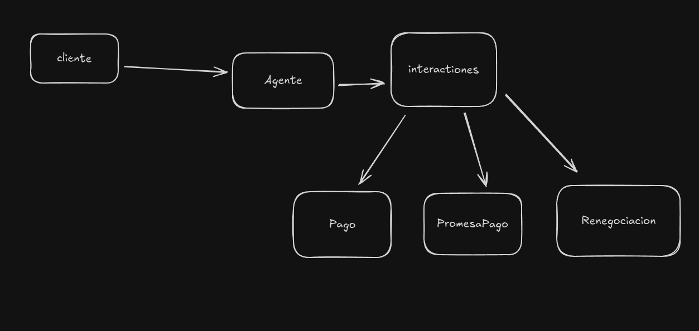
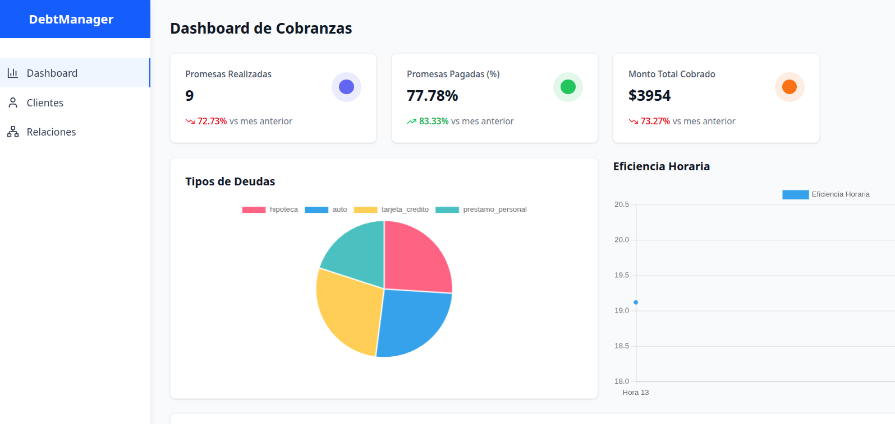
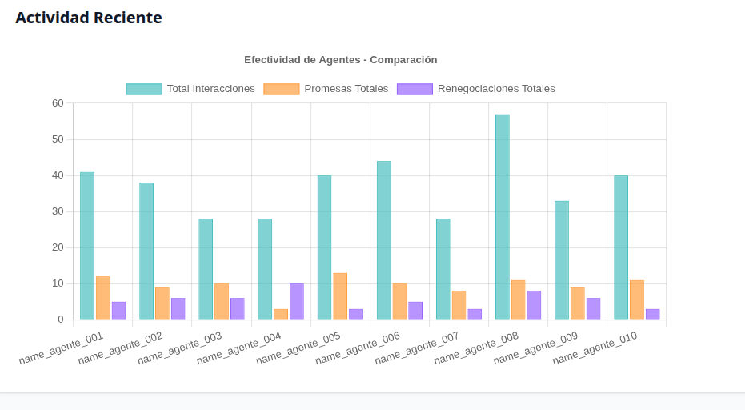
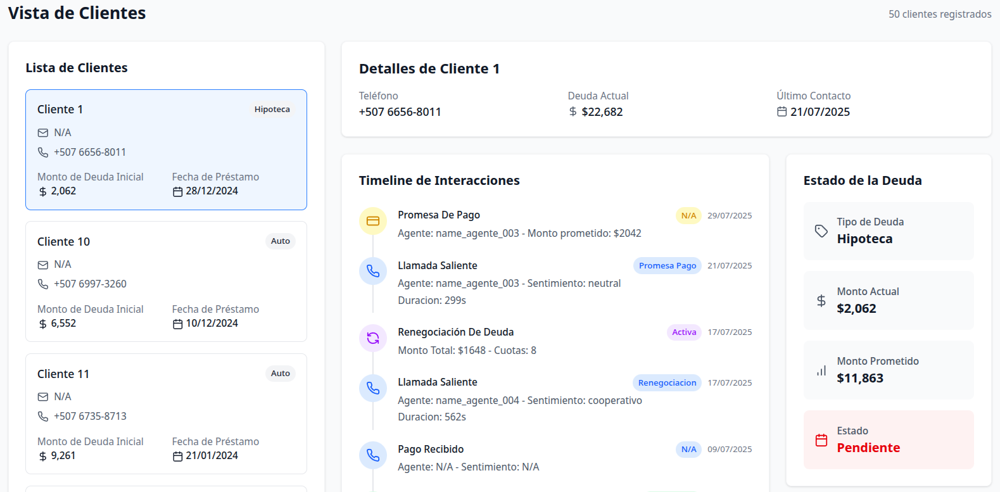
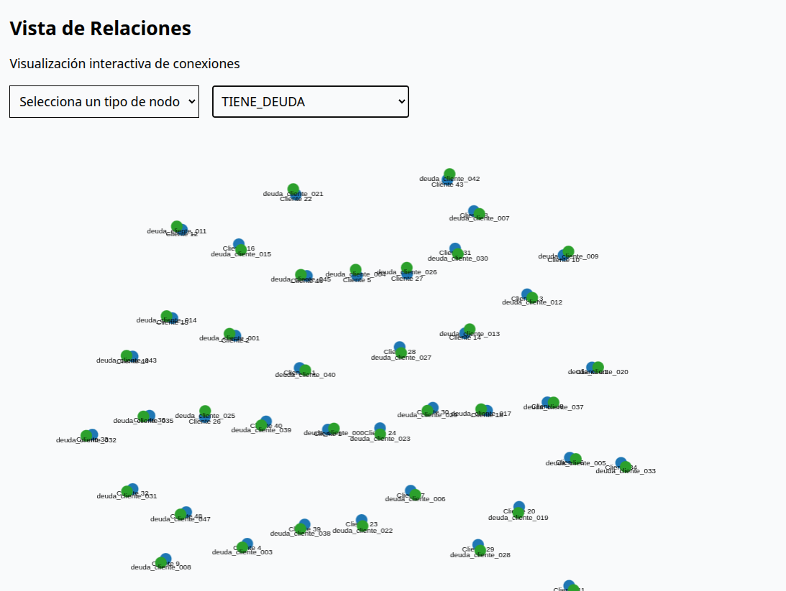

# Informe Técnico

## 1. Introducción

### Contexto del Problema
Una empresa de gestión de cobros necesita analizar y visualizar los patrones de interacción con sus clientes.  
La tarea consiste en construir un sistema que procese datos históricos de interacciones, los almacene en un **grafo de conocimiento usando Neo4j**, y proporcione visualizaciones útiles para identificar patrones y optimizar estrategias de cobro.

### Objetivo General del Sistema
El objetivo principal de este proyecto es desarrollar un sistema de análisis que modele las interacciones con los clientes como un **grafo de conocimiento**.  
Esto permitirá:
- Descubrir patrones de comportamiento complejos.  
- Medir la efectividad de los agentes con mayor precisión.  
- Visualizar la cronología completa de la relación con un cliente.  
- Optimizar las estrategias de cobranza.  

### Breve Descripción de la Solución Propuesta
- **Modelado de datos:** implementación inicial de la estructura de nodos y relaciones en Neo4j.  
- **Inserción de datos:** a partir del archivo `interacciones_clientes.json`, basándonos en el modelo de grafo definido.  
- **API REST:** endpoints requeridos en la prueba técnica para exponer consultas complejas sobre el grafo.  
- **Visualización web:** dashboard interactivo con métricas, vistas gráficas y exploración de nodos.  

---

## 2. Arquitectura General de la Solución

### Diagrama General
*(Imagen pendiente de incluir)*

### Tecnologías Utilizadas
- **Backend:** Node.js + Express + TypeScript  
- **Base de Datos:** Neo4j  
- **Visualización:** React + TailwindCSS + Chart.js + react-force-graph-2d  

### Justificación de las Elecciones Tecnológicas
- **Neo4j:**  
  En la prueba técnica se sugirió utilizar Graphiti (Python). Si bien esta librería ofrece ventajas, no se alineaba con el stack de desarrollo definido.  
  Se optó por **Neo4j + Cypher**, tecnologías con las que ya tengo experiencia. Mi conocimiento en **TypeScript** también permitió un desarrollo más consistente y eficiente.  

- **Node/TypeScript:**  
  TypeScript facilita el manejo de **datos tipados**, lo que mejora la seguridad y la integridad de la información. Esto resulta especialmente útil al trabajar con Neo4j, que carece de un sistema de tipado estricto y puede permitir la inserción de datos inconsistentes.  

- **React:**  
  React es el estándar de la industria para interfaces interactivas. Dispone de librerías para visualización de métricas (**react-chart**) y grafos (**react-force-graph-2d**), lo que agiliza la implementación del dashboard.  

---


## 3. Ingesta y Modelado de Grafo (30%)

### 3.1 Procesamiento de Datos
El **script** se encarga de:
- Leer un archivo JSON con los registros.  
- Validarlos y transformarlos en nodos y relaciones para **Neo4j**.  

Ejemplo de estructura de datos de entrada (`interacciones_clientes.json`):

```json
{
  "metadata": {
    "fecha_generacion": string,    // ISO timestamp
    "total_clientes": number,
    "total_interacciones": number,
    "periodo": string
  },
  "clientes": [
    {
      "id": string,                 // formato: "cliente_XXX"
      "nombre": string,
      "telefono": string,
      "monto_deuda_inicial": number,
      "fecha_prestamo": string,     // formato: "YYYY-MM-DD"
      "tipo_deuda": string           // valores: "tarjeta_credito" | "prestamo_personal" | "hipoteca" | "auto"
    }
  ],
  "interacciones": [
    {
      "id": string,                  // UUID corto
      "cliente_id": string,
      "timestamp": string,           // ISO timestamp con Z
      "tipo": string,                // valores: "llamada_saliente" | "llamada_entrante" | "email" | "sms" | "pago_recibido"
      // Campos condicionales según tipo:
      // Si tipo es llamada_*:
      "duracion_segundos"?: number,
      "agente_id"?: string,
      "resultado"?: string,          // valores: "promesa_pago" | "sin_respuesta" | "renegociacion" | "disputa" | "pago_inmediato" | "se_niega_pagar"
      "sentimiento"?: string,        // valores: "cooperativo" | "neutral" | "frustrado" | "hostil" | "n/a"
      // Si resultado es "promesa_pago":
      "monto_prometido"?: number,
      "fecha_promesa"?: string,
      
      // Si resultado es "renegociacion":
      "nuevo_plan_pago"?: { "cuotas": number, "monto_mensual": number },
      // Si tipo es "pago_recibido":
      "monto"?: number,
      "metodo_pago"?: string,        // valores: "transferencia" | "tarjeta" | "efectivo"
      "pago_completo"?: boolean
    }
  ]
}

```
- Valores nulos: Los campos con valores nulos se almacenan igualmente y posteriormente se asignan a su entidad correspondiente.
	
- Inconsistencias: Fue necesario crear las entidades Agente, ya que no estaban definidas en el JSON original. Además de parsear datos que no son aceptados en neo4j. 

      
## 3.2 Modelo de Grafo

### Entidades (Nodos) principales
- **Cliente**  
- **Agente**  
- **Deuda**  
- **Interacción**  
- - **Pago**  
- - **PromesaDePago**  
- - **Renegociación**  

### Descripción de las entidades
- **Cliente:** Representa a un deudor.  
  *Propiedades:* `id`, `nombre`, etc.  

- **Deuda:** Representa la cantidad de dinero que debe el cliente.  

- **Agente:** Empleado del centro de llamadas.  
  *Propiedades:* `id`, `nombre`.  

- **Interacción:** Una llamada o contacto con el cliente.  
  *Propiedades:* `id`, `fecha`, `tipo` (llamada, email), `resultado`.  
  Se divide en 3 tipos: **Pago**, **PromesaDePago**, **Renegociación**.  

- **Pago:** Registro de un pago realizado por el cliente.  
  *Propiedades:* `id`, `fecha`, `monto`.  

- **PromesaDePago:** Compromiso de pago realizado durante una interacción.  
  *Propiedades:* `id`, `fecha_promesa`, `monto`.  

- **Renegociación:** Representa una renegociación de la deuda actual.  

---

### Relaciones (Cypher)
```cypher
CREATE (Cliente)-[:TIENE_DEUDA]->(Deuda)
CREATE (Cliente)-[:PARTICIPA_EN]->(Interaccion)
CREATE (Interaccion)-[:REALIZADA_POR]->(Agente)
CREATE (Interaccion)-[:GENERO_PAGO]->(Pago)
CREATE (Interaccion)-[:GENERO_PROMESA]->(PromesaDePago)
CREATE (Interaccion)-[:GENERO_RENEGOCIACION]->(Renegociacion)
```


### Representación de la Evolución Temporal de la Deuda

Se decidió **separar la deuda del objeto Cliente**, ya que un usuario puede tener múltiples deudas y estas pueden estar asociadas a distintos tipos de interacciones (por ejemplo: hipoteca, tarjeta de crédito, préstamo de auto, entre otros).  

Además, la **naturaleza temporal** de estos datos hace necesario crear un **nuevo nodo por cada deuda registrada**.  

Mantener la deuda únicamente como un atributo del Cliente implicaría **perder trazabilidad**, ya que no sería posible identificar en qué momento se modificó dicho valor, a menos que se reconstruya el historial a partir de las interacciones, lo cual añade un nivel de complejidad considerable.  

---

### Conexión de Promesas con Pagos

Durante el modelado surgieron **inconsistencias** en la información relacionada con las promesas de pago. El archivo no incluye un indicador explícito (por ejemplo, un campo booleano) que permita saber si una promesa fue cumplida; únicamente se proporciona la **fecha comprometida**.  

Esto genera varias dificultades:

- **Trazabilidad de la promesa:** No queda claro a qué interacción previa corresponde la promesa, lo que complica establecer la relación directa `interacción → promesa → pago`.  

- **Multiplicidad de deudas:** Si un cliente tiene más de una deuda activa, no es posible determinar con precisión a qué deuda está asociada una promesa de pago, ya que solo se dispone del `cliente_id`.  

- **Falta de un identificador raíz:** Sería necesario contar con un identificador de la **deuda** y de la **interacción** que originaron la promesa, para poder enlazarla correctamente con un pago posterior.  


### Qué información derivada vale la pena pre-calcular como propiedades del grafo:

- El estado actual de la deuda: Para permitir filtros y consultas rápidas sobre el riesgo crediticio.

- El monto total pagado: Un dato agregado crucial para el análisis financiero y el seguimiento del cumplimiento.

- El historial de pagos (si existe): Almacenar este registro directamente en la promesa asociada agilizaría la consulta de la trazabilidad completa de pagos de un cliente.

## 3.3 Decisiones de Modelado
### Fundamentación del Modelo Propuesto

- El diseño se seleccionó por su capacidad para responder de manera eficiente y directa a los requerimientos centrales de la prueba técnica. La estructura sigue un esquema intuitivo basado en entidades y relaciones, lo que permite traducir las preguntas de negocio en consultas sencillas y performantes.

- Un claro ejemplo de esta eficacia es la consulta para calcular la efectividad de un agente de cobranza. Gracias al modelado, esta operación compleja se reduce a una única y simple consulta Cypher:

```cypher
MATCH (a:Agente)<-[:REALIZADA_POR]-(i:Interaccion)-[:GENERO_PAGO]->(p:Pago)
```

- Este enfoque permite una representación más realista y flexible del comportamiento de la información, facilitando el análisis de métricas y relaciones clave dentro del sistema.

--- 

## 4. API de Consultas (30%)

La API expone la lógica del grafo a través de endpoints REST.

- `GET /clientes/{id}/timeline`

Descripción: Devuelve un historial cronológico de todos los eventos asociados a un cliente (interacciones, promesas, pagos).

```json
"cliente": {
    "id": "cliente_038",
    "nombre": "Cliente 39",
    "telefono": "+507 6824-4616",
    "email": null,
    "estado_cuenta": null,
    "total_deuda_actual": 85116,
    "fecha_ultimo_contacto": "2025-07-24T13:37:49.851727Z",
    "created_at": "2025-08-28T18:19:56.365Z",
    "updated_at": "2025-08-28T18:19:56.365Z"
    },
"deuda_actual": {
    "id": "deuda_cliente_038",
    "cliente_id": "cliente_038",
    "monto_original": 7093,
    "monto_actual": 7093,
    "tipo_deuda": "hipoteca",
    "fecha_creacion": "2023-09-01",
    "fecha_vencimiento": null,
    "estado": "pendiente",
     "created_at": "2025-08-28T18:19:56.366Z",
    "updated_at": "2025-08-28T18:19:56.366Z"
    },
"eventos": [
    {
        "id": "int_3c6223d9",
        "tipo": "interaccion",
        "fecha": "2025-07-24T13:37:49.851727Z",
        "titulo": "llamada_saliente",
        "descripcion": "disputa",
        "agente": "name_agente_009",
        "monto": null,
        "estado": "disputa",
        "detalles": {
            "resultado": "disputa",
            "monto_prometido": null,
            "sentimiento": "hostil",
            "duracion": 53,
            "tipo_contacto": "llamada_saliente"
        }
    },
```

- `GET /agentes/{id}/efectividad`

Descripción: Calcula métricas de rendimiento para un agente específico.

Métricas Incluidas: total_interacciones, promesas_generadas, monto_recuperado_total.

```json
{
	"success": true,
	"data": {
		"agente": "agente_004",
		"metricas": {
			"total_interacciones": 28,
			"promesas_generadas": 3,
			"promesas_cumplidas": 0,
			"tasa_cumplimiento": 0,
			"monto_recuperado": 0,
			"tiempo_promedio_llamada": 301.1785714285712,
			"pagos_inmediatos": 2,
			"renegociaciones": 10
		}
	},
	"timestamp": "2025-08-28T18:24:49.820Z"
}
```

- `GET /analytics/promesas-incumplidas`

Descripción: Retorna una lista de promesas cuyo plazo ha vencido y no tienen un pago asociado.
.
```json
{
	"data": [
		{
			"clienteId": "cliente_004",
			"promesaId": "2702eb18-66d5-4f18-bd79-8692b6429c88",
			"montoPrometido": 1985,
			"fechaPromesa": "2025-05-25",
			"totalPagado": 0,
			"saldoIncumplido": 1985
		}
	]
}
```

- `GET /analytics/mejores-horarios`

Descripción: Analiza a qué horas del día las interacciones tienen mayor probabilidad de resultar en un pago o una promesa cumplida.

Lógica de Análisis: Agrupa todas las interacciones por hora del día. Para cada hora, calcula la tasa de "éxito" (interacciones que llevaron a una promesa cumplida).

```json
	"data": [
		{
			"hora": 13,
			"exitosas": 96,
			"totalInteracciones": 502,
			"efectividad": 19.12
		}
	]
```

## 5. Visualización Web (30%)
### 5.1 Dashboard General
Muestra una vista de métricas. 
- KPIs Mostrados: Tasa de recuperación global (%), total de promesas vs. monto cobrado, promesas pagadas.
- Gráficos Incluidos: Distribución de los tipos de deuda, Eficiencia Horaria y Efectividad de Agentes - Comparación

## 5.2 Vista de Cliente Individual
Ofrece una vista de 360 grados de un cliente.
- Timeline Interactivo: Componente principal que muestra los eventos del endpoint `/clientes/{id}/timeline`. Cada interacción muestra su respectiva información como el tipo, resultado, duración y fecha.
- Estado de Deuda: Tipo de deuda y el monto prometido.
- Lista de clientes: Información básica del cliente: teléfono, fecha de préstamo y monto de deuda inicial. 








## 5.3 Vista de Grafo
Permite la exploración libre de las conexiones.
- Herramienta Usada: `react-force-graph-2d`.
- Filtros Implementados: El usuario puede filtrar por tipo de nodo y el los tipos de relaciones.
- Inconveniente en la Visualización: La implementación actual no es la más óptima, ya que recupera todos los nodos junto con sus relaciones, lo que en algunos casos genera duplicados debido a las múltiples conexiones existentes. Además, el filtrado se realiza en el frontend, lo que dificulta el manejo eficiente de la información. Por motivos de tiempo, esta parte quedó con funcionalidades que aún no están correctamente diseñadas ni optimizadas.



## 5.4 Video Demostrativo

[](https://www.youtube.com/watch?v=qCuOKG9y9Zw)

## 6. Evaluación y Reflexión

## 6.1 Preguntas Clave
- Ventaja del grafo: Las bases de datos de grafos permiten visualizar la información de forma más detallada y explícita, ya que las relaciones se describen por sí mismas. Además, es posible apoyarse en herramientas que facilitan la exploración y visualización de los grafos, mostrando cómo interactúan entre sí los distintos nodos.

- Escalabilidad: Neo4j está diseñado para manejar múltiples relaciones de manera eficiente, lo que facilita tanto el desarrollo como la ejecución de queries complejas. En contraste, una base de datos SQL podría presentar limitaciones frente a este tipo de escenarios de alta complejidad relacional.

## 6.2 Limitaciones y Mejoras Futuras
Una de las principales limitaciones durante el desarrollo de la prueba fue la inconsistencia en los datos. Por ejemplo, los agentes no estaban definidos en el archivo JSON, lo que generaba dudas sobre la consistencia de la información. Entiendo que, al tratarse de una prueba técnica, estos detalles pudieron haberse incluido con la intención de evaluar la capacidad de análisis; sin embargo, también implicaron una pérdida considerable de tiempo, ya que resulta complejo estructurar información cuando faltan datos clave.

En escenarios relacionados con transacciones o simulaciones de estas, la situación se complica aún más al intentar reconstruir el historial. En este aspecto, considero que Neo4j no siempre resulta la base de datos más adecuada, no tanto por ser de grafos, sino porque carece de un esquema rígido que delimite la estructura de los nodos. Por ejemplo, si se agrega una propiedad nueva a un nodo Deuda, Neo4j no exige que todos los demás nodos de ese tipo tengan dicha propiedad. Esto representa un reto, especialmente cuando se trabaja con lenguajes no tipados, ya que no se puede garantizar la ausencia de información faltante ni evitar la presencia de atributos adicionales. En contraste, en SQL, el propio motor de base de datos rechazaría cualquier intento de insertar un campo no definido en la tabla, lo que brinda mayor control y consistencia en este tipo de escenarios.

Considero que la prueba estuvo más orientada a evaluar el diseño y modelado de la información. Me hubiera gustado implementar pruebas automatizadas (tests), pero debido a la complejidad creciente del desarrollo tuve que dejarlas de lado.

Por otro lado, trabajar con Neo4j presenta limitaciones en las consultas que involucran múltiples nodos, ya que en algunas ocasiones se generan resultados duplicados, generalmente por una mala implementación de la query. Con una buena base de pruebas, habría sido posible desarrollar estas consultas con mayor claridad y confianza.

Finalmente, aunque la prueba permitía el uso de inteligencia artificial, esto también trae consigo ciertas desventajas. En muchos casos, se tiende a priorizar la cantidad de código generado sobre la calidad, y sin un respaldo de pruebas adecuadas, resulta difícil refactorizar y mantener ese código de forma segura.

## 7 Conclusiones
El desarrollo de esta prueba técnica ha sido una experiencia enriquecedora que me ha permitido aplicar y consolidar mis conocimientos en bases de datos de grafos, modelado de datos y desarrollo de APIs RESTful. A lo largo del proceso, he enfrentado diversos desafíos, desde la interpretación y limpieza de datos inconsistentes hasta la optimización de consultas complejas en Neo4j.


Este sistema demuestra la efectividad de una base de datos de grafos para el análisis de patrones de interacción y la gestión de riesgos de cobro. La representación de los datos como un grafo de conocimiento no solo simplifica la ejecución de consultas complejas, sino que también proporciona una visualización intuitiva, permitiendo a los analistas identificar de forma rápida a clientes de alto riesgo y diseñar estrategias de cobranza más eficientes.